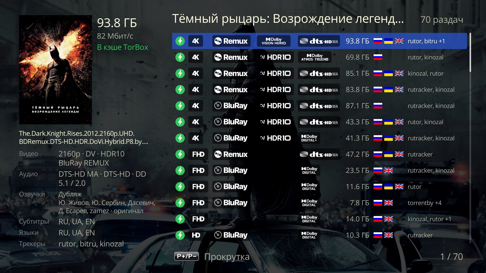
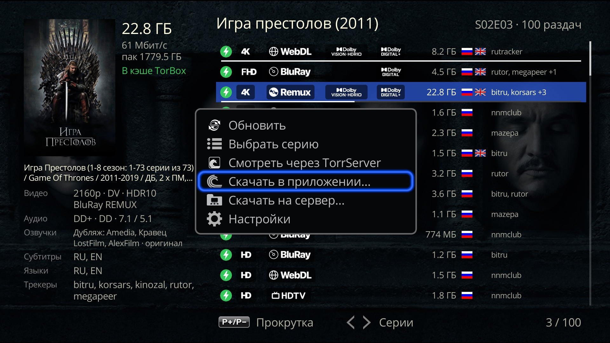

# Melange для Dune HD

## Что это
Плагин для Dune HD: добавляет пункт **«Melange»** в меню **«Смотреть…»** карточки фильма или сериала в каталоге **«Фильмы»** Дюны. Пункт открывает список раздач из **вашего** конфига AIOStreams, выбранная раздача играет во встроенном плеере Дюны.

**Нужен Debrid — Real-Debrid или TorBox с подпиской** — или свой готовый конфиг AIOStreams. Без ключа Debrid Melange конфиг не создаёт; без Debrid можно смотреть только через свой конфиг с раздачами P2P и TorrServer (подробнее — «Что нужно»).

Что умеет:
- список до 100 раздач в порядке AIOStreams: значки качества (разрешение, источник, HDR / Dolby Vision, звук), размер, флаги языков, трекеры; слева — подробности выбранной раздачи: в кэше ли она, видео, аудио, озвучки, субтитры, языки;
- просмотр с историей Дюны: процент на кнопке «Melange [NN%]» в карточке, фильм или серия в ряду «Продолжить просмотр», возврат с того же места;
- сериалы: все серии сезона подряд в плеере (P+ / P− и автопереход) на той же раздаче, листание серий прямо в списке клавишами ← / →;
- просмотр через TorrServer — без Debrid (раздачи P2P) или для раздачи не из кэша, с той же историей;
- озвучки студий — по названию раздачи и её дорожкам; по желанию — дорожки из JacRed;
- настройка с телефона по QR-коду; там же — «Скачать лог».

 

## Что нужно
- **Dune HD на Android с прошивкой r22 или новее.** Проверено только на Pro 8K Plus с прошивкой 260827_0003_r24; на других Android-моделях Дюны, на ATV-приставках с приложением Dune HD (Homatics и др.) и на r22 должно работать, но не проверялось — если что-то не так, пришлите лог (раздел «Лог»).
- **Не работает:** на Дюнах на Sigma / Linux (Solo 4K, Duo 4K, Base 3D, TV-303D и старше — на них нет каталога «Фильмы» с пунктами «Смотреть…» и Android-приложений) и не обещается на моделях с 1 ГБ памяти (SmartBox 4K, SmartBox 4K Plus, Traveler, Neo 4K, 4K Neo, Neo 4K T2).
- **Ключ Debrid** — Real-Debrid или TorBox (с подпиской): с ним Melange сам создаёт конфиг AIOStreams на выбранном публичном сервере (или на своём сервере AIOStreams) (поиск раздач — JacRed, просмотр — через Debrid) и показывает логин и пароль, чтобы настроить его под себя в веб-настройках AIOStreams.
- Или **свой конфиг AIOStreams**, уже настроенный (сервисы, фильтры, лимиты), — тогда ключ на странице не нужен; без Debrid, с раздачами P2P, нужен TorrServer (приложение TorrServe на Дюне). Свой конфиг Melange не меняет — только читает список раздач.
- Телефон в той же домашней сети, что и Дюна, — для страницы настроек.
- **JacRed** — ничего делать не нужно: по умолчанию публичный `jacred.stream`, можно выбрать другой встроенный или свой. В конфиге Melange JacRed ищет раздачи — не ответил серверу AIOStreams, раздач не будет. При своём конфиге он нужен только для дорожек и озвучек: не ответил — дорожек не будет, остальное работает.

## Установка
1. Скачайте zip со страницы релизов https://github.com/a1d4r/dune-hd-melange/releases — последний релиз, файл `dune_plugin_melange_<версия>.zip` в разделе Assets. Скопируйте его на флешку или во внутреннюю память Дюны.
2. На Дюне откройте **«Источники»**, найдите zip и нажмите ENTER.
3. Примерно через полминуты в меню **«Смотреть…»** карточек появится пункт **«Melange»**, перезагрузка не нужна. Если карточка была открыта во время установки — выйдите из неё и откройте снова.

Обновление — новый zip поверх старого тем же способом: настройки и ссылка на страницу настроек сохраняются. Удаление — в списке плагинов Дюны (вместе с плагином стираются и его настройки).

## Первая настройка (по QR)
**Откуда открыть экран настроек** (любой путь ведёт на один и тот же экран):
- **«Настройки» → «Приложения» → «Melange»**;
- иконка **Melange** в **«Приложения» → «Dune HD»**: ENTER открывает экран, а MENU → **«Настройки»** — тоже;
- MENU на экране со списком раздач → **«Настройки»**;
- если конфига ещё нет, при выборе «Melange» в карточке появится **«Нет конфига AIOStreams — откройте настройки Melange»** (при своём конфиге без ссылки — «Не задана ссылка на свой конфиг AIOStreams») с кнопками **«Настроить»** и **«Закрыть»** — «Настроить» откроет экран настроек.

**Экран настроек.** Строка **«AIOStreams — конфиг Melange»** или **«AIOStreams — свой конфиг»** — с адресом сервера или **«не задан»**; строка **JacRed** — выбранный JacRed (свой — его хостом); кнопки **«Настроить с телефона»** и **«Сменить ссылку»**.

1. Нажмите **«Настроить с телефона»**: появится QR-код, под ним адрес страницы текстом и подсказка «Страницу можно сохранить в закладки».
2. Отсканируйте QR телефоном — откроется страница **«Melange — настройки»**.
Страница — на языке Дюны (русский или английский; если язык Дюны прочитать не удалось — на языке браузера). Разделы сверху вниз:

3. **Конфиг AIOStreams — откуда Melange берёт раздачи**, один выбор из двух; видны поля только выбранного (без JavaScript — все):
   - **«Melange создаст конфиг»** — нужен ключ Real-Debrid или TorBox; раздачи ищет JacRed (раздел ниже), смотрятся через Debrid. Внутри:
     - **«Сервер AIOStreams»** — по умолчанию `aiostreams.12312023.xyz`; у остальных серверов списка нет своего ключа TMDB — без него AIOStreams не сверяет названия и находит меньше раздач сериалов, поэтому под выбором такого сервера — поле **«Ключ TMDB (необязательно)»**: [themoviedb.org](https://www.themoviedb.org/settings/api) → Settings → API, ключ v3. **«Проверить»** — как у ключей Debrid. С `aiostreams.fortheweak.cloud` не отвечает `jacred.stream` — при этом сервере выберите другой JacRed (предупреждение — в разделе JacRed). Последний пункт — **«Другой сервер…»**, ваш AIOStreams (например, на NAS): поле **«Адрес сервера AIOStreams»** (`http://хост:порт` или `https://хост`, без пути). **«Проверить»** — Дюна спросит у сервера его версию и есть ли у него свой TMDB. Melange создаёт и правит конфиг там же, по тем же правилам; поле «Ключ TMDB» для него видно всегда. Если сервер требует пароль на создание конфигов — сохранение покажет его ошибку.
     - **«Ключ Real-Debrid»** (где взять: [real-debrid.com/apitoken](https://real-debrid.com/apitoken)) и **«Ключ TorBox»** (где взять: [torbox.app/settings](https://torbox.app/settings)) — нужен хотя бы один, можно оба. **«Проверить»** под полем — Дюна спросит сервис и покажет «ключ верный, премиум до ДД.ММ.ГГГГ», «ключ верный, но премиума нет», «ключ не принят» или «ключ не проверен» (нет связи с сервисом); ничего не сохраняется.
     - состояние конфига: пока у выбранного сервера его нет — «Конфига на этом сервере ещё нет», а главная кнопка называется **«Сохранить и создать конфиг»**. После создания здесь же — ссылка **«Открыть настройки AIOStreams»**, **логин** и **пароль** конфига (скрыт; «глаз» показывает, **«Копировать»** копирует): в веб-настройках AIOStreams введите пароль — так конфиг настраивается под себя (фильтры, сортировка, другие аддоны). Пароль конфига в AIOStreams не меняйте: Melange его не узнает, забудет конфиг и при следующем сохранении создаст новый.
     **Что в конфиге Melange:** раздачи RD не из кэша скрыты (у TorBox видны как «Нужно скачать»); отфильтрованы 144p–576p, CAM / SCR / TS / TC, 3D, XviD / DivX; раздачи на русском — выше. Если у следующей серии нет раздач в кэше, AIOStreams может заранее добавить её раздачу в Debrid.
     Сохранение меняет в конфиге только своё: ключи Debrid, выбранный JacRed (источник `melange`; если вы его удалили — вернётся, если выключили — останется выключенным), ключ TMDB и сверку названий (без TMDB она выключается — иначе сервер не примет конфиг). Ключ Debrid или TMDB, который вы ввели в веб-настройках сами, Melange не стирает — убирает только поставленные им. Остальные ваши правки в веб-настройках тоже остаются. Конфиг — у каждого сервера свой: выбрали другой сервер — на нём создастся новый, вернулись — подхватится прежний; старые конфиги на серверах не удаляются.
   - **«У меня свой конфиг AIOStreams»** — **«Ссылка на конфиг»**: `https://<инстанс>/…/manifest.json` (`stremio://…` тоже подойдёт). Где взять: на странице своего конфига AIOStreams — раздел **«Save & Install»**, блок **Stremio**, поле **«Direct Manifest URL»**. **«Проверить»** — Дюна запросит манифест и покажет «OK: манифест … v…, есть ресурс stream» или причину. Melange этот конфиг только читает — ничего не создаёт и не правит, ключи Debrid для него не нужны. Без Debrid (раздачи P2P) нужен TorrServer — раздел ниже.
   Ключи, адреса и созданные конфиги обоих вариантов хранятся при любом выборе: переключились и вернулись — всё на месте. Свой адрес манифеста из прежних версий переносится сам: выбран «У меня свой конфиг».
4. **JacRed** — заголовок по выбору выше: **«JacRed — поиск раздач и озвучки»** (созданный конфиг ищет раздачи в нём, Melange берёт оттуда же дорожки и озвучки; если выбран сервер, с которого `jacred.stream` не отвечает, — здесь предупреждение) или **«JacRed — дорожки и озвучки»** (свой конфиг ищет раздачи сам). Выбор одного: встроенные публичные `jacred.stream` (по умолчанию), `jr.maxvol.pro`, `jac.stull.xyz`, `jac.red` или **«Свой»**. Поля своего — адрес (`http://хост:порт` или `https://хост`) и ключ (необязательно; если ваш JacRed его требует) — можно заполнить заранее: они сохраняются, но используются, только когда выбран «Свой». При открытии списка раздач Melange спрашивает выбранный JacRed; не ответил — `jacred.stream` (если выбран не он), на оба вместе не больше 8 секунд. **«Проверить»** — Дюна делает три поиска разных фильмов и сериала в выбранном JacRed (свой — по введённым адресу и ключу, ещё не сохранённым) с паузой 2 с и показывает под кнопкой строку «доступен · время · раздач»; у «Свой» без адреса или с адресом не того вида — ошибка формата. **«Сравнить все»** — те же поиски в каждом встроенном JacRed и в своём (если адрес заполнен), таблица «доступен · время · раздач» — помогает выбрать. Пока идёт одна проверка, обе кнопки неактивны. Ничего не сохраняется. `jac.red` отвечает ошибкой на частые запросы — пауза для этого.
   Свой JacRed с адресом домашней сети публичному серверу AIOStreams недоступен (под полем — подсказка): для поиска раздач нужен адрес из интернета; домашний годится для дорожек и озвучек или вместе с «Другим сервером…» в домашней сети.
   Адрес JacRed из 0.33 и раньше переносится сам: публичный — становится выбранным, свой — в поля «Свой» вместе с ключом, и выбран «Свой»; если адреса не было — выбран `jacred.stream`.
5. **Смотреть через TorrServer** — **«Адрес TorrServer (необязательно)»**. Пусто — `127.0.0.1:8090`: рекомендуется установить на Дюну Android-приложение TorrServe (TorrServer MatriX) и включить в нём запуск при включении Дюны — оно слушает этот адрес; свой — `http://хост:порт`, доступный Дюне. **«Проверить»** — Дюна спросит TorrServer и покажет под кнопкой «TorrServer MatriX.… отвечает» или причину («соединение отклонено — установите и запустите приложение TorrServe на Дюне», «Нет ответа за 3 с», «Ответил не TorrServer MatriX»); ничего не сохраняется.
6. **Дополнительно** (свёрнуто):
   - **«Скачать на сервер (необязательно)»** — до 5 серверов qBittorrent или rdt-client для пункта «Скачать на сервер…»: название, адрес веб-интерфейса (`http://хост:порт`), логин и пароль (логин пустой — без входа), категория (необязательно; торрент встанет в неё), теги через запятую (необязательно; недостающие qBittorrent создаст сам), «Для кэша» (Не из кэша / TorBox / Real-Debrid): в меню «Скачать на сервер…» курсор встанет на сервер с сервисом, в кэше которого раздача; у раздачи не из кэша (или из кэша сервиса без своего сервера) — на первый сервер «Не из кэша». Отправить можно на любой сервер. На странице видны только заполненные блоки; **«Добавить сервер»** открывает следующий пустой, **«Дублировать»** — копирует блок (адрес, логин, пароль, категорию, теги, «Для кэша») в следующий пустой с названием «… (копия)»: удобно для второго сервера с тем же адресом и другой категорией или тегом. Когда заняты все 5 блоков, обе кнопки недоступны. Пустой блок — сервера нет; удалить сервер — очистить его поля. Серверы при сохранении не проверяются — для этого у каждого блока своя кнопка **«Проверить»**: Дюна войдёт в клиент с этим логином и паролем (qBittorrent 4.x и 5.x, rdt-client) и покажет под кнопкой «OK: вход принят · версия … · категория … есть» или причину (неверный логин или пароль; qBittorrent временно заблокировал Дюну; нет связи; вход ответил, но API не отвечает — это не qBittorrent или не тот порт). Каких категорий и тегов на сервере ещё нет — тоже покажет: qBittorrent создаст их при первой закачке (rdt-client теги не хранит). Ничего не сохраняется. **Осторожно:** после нескольких неверных паролей подряд (по умолчанию 5) qBittorrent блокирует Дюну на час — и закачки с неё тоже.
7. Нажмите **«Сохранить»**. Сохранение проверяет вид адресов и ключей, а заданные ключи Real-Debrid, TorBox и TMDB варианта «Melange создаст конфиг» — ещё и у самих сервисов (у своего конфига ключи не проверяются): если сервис ключ не принял, ничего не сохраняется; если сервис недоступен или премиума нет — сохраняется, а под кнопкой появляется предупреждение. Адреса AIOStreams, JacRed, TorrServer и серверов при сохранении не проверяются — для этого кнопки **«Проверить»**. Если всё в порядке — на странице «Сохранено. Дюна подхватит настройки сама.» (и итог проверки ключей, если они заданы), окно с QR на телевизоре закроется само (если создаётся конфиг — когда он создан, но не позже чем через 45 с), а на экране настроек появятся адрес сервера и выбранный JacRed.
   Пока на выбранном сервере нет конфига, без ключа Debrid ничего не сохранится: «Для конфига нужен ключ Real-Debrid или TorBox — или выберите „У меня свой конфиг“»; свой конфиг без ссылки — «Укажите ссылку на конфиг — или выберите „Melange создаст конфиг“».
   Затем (если выбрано «Melange создаст конфиг») Дюна создаёт или обновляет конфиг на выбранном сервере — на кнопке «Создаю конфиг…» / «Обновляю конфиг…», под ней итог: «Конфиг AIOStreams создан на …», «… обновлён» или причина — ответ сервера как есть, «лимит запросов сервера …, повторите через минуту», нет связи. Настройки при этом уже сохранены; повторить — снова «Сохранить». Если оба ключа Debrid стёрты, уже созданный конфиг не меняется («Конфиг не изменён: нужен хотя бы один ключ Debrid»).

Кнопка с глазом рядом с полем показывает скрытое значение.

**Если что-то не подошло**, ничего не сохраняется, а над кнопкой «Сохранить» появляется причина (введённое остаётся в полях):
- «Нужен адрес вида https://…/manifest.json — скопируйте ссылку на конфиг из AIOStreams» — ссылка не того вида (например, без `manifest.json` на конце, с пробелами или с `?` / `#`);
- «Свой JacRed: нужен адрес вида http(s)://хост[:порт]; ключ — 8–200 символов без пробелов, & и #» — адрес с путём или параметрами (ключ — в своё поле), длиннее 300 символов, ключ короче 8 символов; или выбран «Свой», а адрес не задан; или заполнен ключ своего JacRed без адреса (укажите адрес или очистите ключ);
- «Ключ Real-Debrid / TorBox / TMDB: …» — ключ не того вида; «…: ключ не принят (HTTP 401)» — сервис ключ не принял.

**Про ссылку на страницу.** Ссылка постоянная — её можно сохранить в закладки телефона. Кто знает ссылку, тот видит и меняет настройки, поэтому никому её не пересылайте. Кнопка **«Сменить ссылку»** (подтверждение «Старые закладки перестанут работать» → **«Сменить»**) выдаёт новую ссылку и новый QR, старая перестаёт открываться. Если у Дюны в сети сменился адрес, закладка не откроется — откройте QR заново.

Если вы поменяете пароль своего конфига в AIOStreams, ссылка на конфиг станет другой — введите новую на этой же странице.

## Как смотреть
1. Откройте фильм в каталоге **«Фильмы»** → **«Смотреть…»** → **«Melange»**. Сериал: в карточке сериала через **«Сезоны»** выберите серию и так же **«Melange»**.
2. Откроется список раздач. Вверху — название, сезон и серия, число раздач. Слева — подробности выбранной раздачи, в том числе:
   - **«В кэше Real-Debrid»** (зелёным) — раздача уже лежит в вашем Debrid и начнёт играть сразу; название сервиса — по тому, что прислал AIOStreams;
   - **«Нужно скачать»** (серым) — раздачи нет в кэше Debrid;
   - **«неизвестно»** — AIOStreams не сообщил, в кэше ли раздача;
   - **«P2P»** — раздача без Debrid, играет через TorrServer;
   - **«Озвучки»** — «Дубляж: <студии>», затем остальные студии; **«Видео»**, **«Аудио»**, **«Субтитры»**, **«Языки»**, **«Трекеры»**.
3. Клавиши: вверх / вниз — по раздачам; P+ / P− — страница («Прокрутка»); ENTER — смотреть; **INFO** — «Сведения о раздаче»: на первой странице главное о файле, дорожках и источнике, P+ / P− — следующие страницы со всем, что прислал AIOStreams и вычислил Melange (для разбора ошибок); у серии **← / →** — список предыдущей / следующей серии («Серии»), курсор встанет на ту же раздачу, если она там есть. «Назад» из пролистанной серии — сразу в карточку. **MENU** → **«Обновить»** — запросить список у AIOStreams заново (например, если JacRed ответил не сразу), курсор останется на той же раздаче; если не вышло — окно «Список не обновился» с причиной, список прежний. **MENU** → **«Выбрать серию»** (у серии) — экран «Сезоны» Дюны: выбранная серия откроет свой список раздач (если не вышло — «Серия … не загрузилась»). **MENU** → **«Смотреть через TorrServer»** (у раздачи с хэшем) — открыть раздачу через TorrServer, а не через Debrid (раздачи P2P так играют и по ENTER): пока TorrServer ищет список файлов — окно «Открываю через TorrServer» с секундами, числом пиров и «Отмена»; потом встроенный плеер. У сериала все серии сезона из той же раздачи — в плейлисте плеера. Если не вышло — «Не открылось через TorrServer» с причиной: TorrServer не отвечает (установите и запустите приложение TorrServe), не принял раздачу, за минуту не пришёл список файлов (мало сидов), в раздаче нет файла этой серии. **MENU** → **«Скачать в приложении…»** (у раздачи с хэшем) — открыть её magnet-ссылку в приложении на выбор: Android покажет все установленные приложения, которые принимают magnet (торрент-клиент, qBitController / Transdroid для своего сервера, TorrServe). Не выбирайте там «Всегда», если magnet открывают несколько приложений. **MENU** → **«Скачать на сервер…»** (у раздачи с хэшем, если в настройках задан сервер) — список серверов, курсор — на сервере с сервисом, в кэше которого раздача, иначе на первом «Не из кэша»; у сервера, куда раздача уже добавлена, — пометка «уже добавлено». ENTER — Melange сам добавит magnet-ссылку в клиент (с категорией и тегами, если заданы) и покажет «Добавлено в <сервер>»; повторно та же раздача на тот же сервер не отправляется — «Уже добавлено в <сервер>». Если не вышло — «Не добавлено в <сервер>» с причиной: нет связи с сервером, неверный логин или пароль, клиент не принял раздачу (может быть, она там уже есть).
4. **Серии подряд.** Если раздача в кэше, плеер играет весь сезон по порядку на этой же раздаче (P+ / P− и автопереход), в конце сезона — первую серию следующего, если она есть в той же раздаче. Если в раздаче нужной серии нет — окно «Серии S01E05 нет в этой раздаче» с кнопками **«Выбрать раздачу»** (список этой серии) и **«Стоп»**.
5. **Продолжить просмотр.** Фильм или серия, начатые на раздаче **в кэше** или через TorrServer, появляются в ряду «Продолжить просмотр» Дюны, а на кнопке в карточке — «Melange [NN%]».
   - Из «Продолжить просмотр» — сразу та же раздача с того же места, без списка: из кэша — через Debrid, иначе — через TorrServer, если он отвечает. Если AIOStreams её больше не присылает или TorrServer не отвечает — откроется список.
   - Кнопка «Melange [NN%]» в карточке открывает список; выберите ту же раздачу — плеер сам предложит «Продолжить воспроизведение» или «С начала».
   - В карточке сериала (не через «Сезоны») «Melange» откроет список той серии, на которой вы остановились, а если она досмотрена — следующей. Без истории — первую серию первого сезона.

## Лог
Откройте страницу настроек (закладка или QR через «Настроить с телефона») → **«Скачать лог»**. Скачается файл `melange-<дата>-<время>.log`; время в нём — по UTC.

Что в логе: действия Melange с последнего включения Дюны — названия фильмов и серий, которые вы открывали, число раздач, время ответов, выбранные раздачи, ошибки. В начале файла — версия плагина, имя сервера AIOStreams (другой сервер — `own`) и чей конфиг (`Melange config` / `own config`), выбранный JacRed (свой — как `<jacred>`), число серверов «Скачать на сервер» и TorrServer (`127.0.0.1:8090` или свой — как `<ts>`). **Скрыты:** адрес вашего конфига (и его длинные части — идентификатор и зашифрованный пароль), пароли и адреса конфигов, созданных Melange, адрес и ключ своего JacRed (даже если он не выбран; в строках лога — `<jacred>`), адрес своего сервера AIOStreams (`<aio>`), адреса серверов «Скачать на сервер» (`<server>`) и своего TorrServer (`<ts>`), ключи Real-Debrid, TorBox и TMDB, пароли серверов, ссылки на воспроизведение с токенами Debrid.

После перезагрузки Дюны лог начинается заново — скачайте его **до** перезагрузки. Если лога нет, в файле будет «Лог пуст: после перезагрузки Дюны он начинается заново».

Куда прислать: заведите Issue на GitHub — https://github.com/a1d4r/dune-hd-melange/issues — опишите, что делали и что пошло не так, и приложите лог. Перед тем как прикрепить файл, просмотрите его: в нём названия фильмов и серий, которые вы открывали.

## Если что-то не так
- «AIOStreams не отвечает» / «AIOStreams вернул ошибку» / «Непонятный ответ AIOStreams» — проблема на стороне инстанса или сети; попробуйте позже; подробности — в логе (раздел «Лог»).
- «AIOStreams не нашёл потоков» — для этого фильма ничего не нашлось. В конфиге Melange частая причина — JacRed не ответил серверу AIOStreams: выберите другой JacRed («Сравнить все») или другой сервер AIOStreams. В своём конфиге — проверьте фильтры и сервисы.
- «Слишком большой ответ: уменьшите лимит результатов в настройках AIOStreams».
- «У фильма нет IMDb-id» — у карточки в каталоге Дюны нет IMDb, Melange такой фильм не найдёт.
- «Список устарел, откройте его заново» — откройте фильм из карточки ещё раз.
- «Нет конфига AIOStreams — откройте настройки Melange» / «Нет конфига AIOStreams: Настройки → Приложения → Melange» (второе — в плеере, например на следующей серии) — на выбранном сервере нет конфига: не создался (лимит сервера, нет связи) или выбран другой сервер. Откройте страницу настроек и нажмите «Сохранить и создать конфиг». При своём конфиге без ссылки — «Не задана ссылка на свой конфиг AIOStreams» / «Задайте ссылку на конфиг: …».

## Известные ограничения
- Проверено только на Dune HD Pro 8K Plus с прошивкой r24. На r22 ряд «Продолжить просмотр» для фильмов из Melange может не появляться (такой ряд для онлайн-фильмов прошивка завела в r24) — не проверялось.
- Раздачи **не в кэше** и с неизвестным статусом, запущенные через Debrid, играют **без истории**: ни процента на кнопке, ни «Продолжить просмотр». Через TorrServer — с историей.
- **Real-Debrid и «Нужно скачать»** (свой конфиг; в конфиге Melange такие раздачи RD скрыты). Каждый запуск такой раздачи добавляет торрент в ваш аккаунт RD. RD не отдаёт раздачи с `WEB-DL` в имени (вместо фильма — заглушка «File was removed…» или ошибка) и после нескольких новых раздач подряд на время отказывает во всех добавлениях. Не нажимайте такие раздачи больше 1–2 раз подряд — подождите несколько минут.
- Серии подряд в плеере — только на той же раздаче и только если она в кэше (через TorrServer — серии, которые есть в раздаче); переключиться на другую раздачу автоматически Melange не пытается — он покажет окно с выбором.
- На экране не больше 100 раздач, остальные не показываются; слишком большой ответ AIOStreams (больше 6 МБ) не открывается.
- Только фильмы и сериалы с IMDb-id в карточке Дюны.
- Страница настроек открывается только из домашней сети, по адресу Дюны.
- **TorrServer:** скорость и время до начала зависят от сидов раздачи. TorrServer с паролем не поддерживается. После серии, переключённой в плеере (P+ / автопереход), список раздач по «Стоп» остаётся на первой серии.
- Интерфейс плагина — на русском и английском, по языку Дюны; название — «Melange» в обоих.

## Лицензия
MIT — см. файл `LICENSE` в репозитории. Значки качества — из [github.com/kingsizew/badges](https://github.com/kingsizew/badges).
